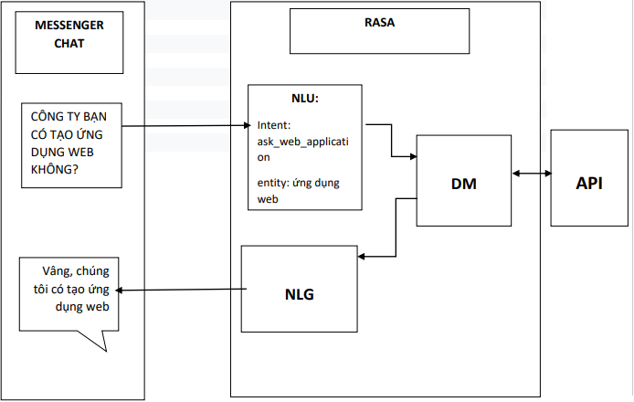
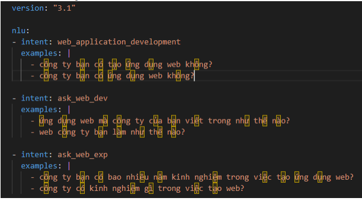
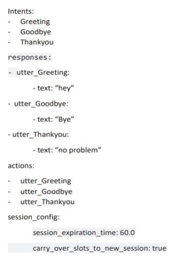
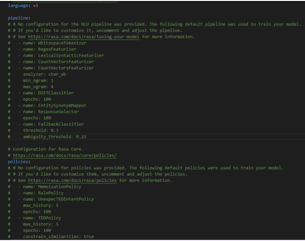
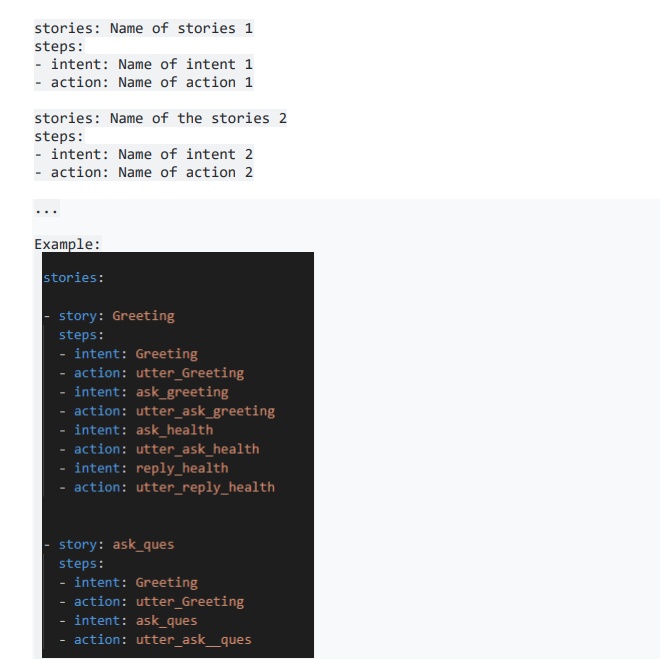

# Chatbot-rasa
Deploy your own chatbot with RASA

We used to heard about the question and answering, when we ask something we have a 
answer. It like we play a quiz game. But it just the answer from the question. How about the 
question but related to each other?. Imagine you go to the university to have the quiz test but 
the question 1 related to question 2, 3, 4,…etc.. That’s the time you think that we can’t get all 
the answer. But sometimes, the answer is in the question related to each other. That’s how we 
have “context”. 

In this introduction, I will introduce you a friend that can have a conversation, to answer and 
advised you everything you need. Even you are not the developer and not good in Machine 
Learning, deep learning..etc.. You still can make your own chatbot by using Rasa


## Introduction
Rasa is an open source machine learning framework for building AI assistants and chatbots. 
Mostly you don’t need any programming language experience to work in Rasa
Advantages of Rasa:
- Integration- being open-source and with the ease of building chatbots, Rasa can be 
integrated into systems easily and automate stuff.
- Customization — who said we cannot add our touch? Rasa is flexible and can be 
modified to fit needs.
- Interactive learning- Rasa is trained to learn on its own. It doesn’t matter if 
businesses don’t’ know how to train the AI, it learns on its own as you talk to it. Talk 
about AI being so cool!
- Not your regular static machine- Rasa is not a machine but a conversational AI bot 
which is the replica of the human interaction mechanism. You could expect the bot 
to be extremely interactive learning from the chats.

## Setup
- Step 1: Install anaconda and create env with python 3.7
- Step 2 : Install some modules we need. I highly recommend you use rasa 1.10.3
  ```bash
  pip install rasa==1.10.3
  pip install -U tables==3.6.1
  pip install -U ipython
  python -m spacy download en
  pip install nest_asyncio==1.3.3
  ```
## Create a chatbot
- Step 1 : Run this command to create your chatbot project
  ```bash
  Rasa init
  ```
  Now you can see that in folder you have create that have the file 
  config.yml, data/nlu.md, domain.yml, data/stories.md. This is all the file 
  you need to care about it.
- Step 2 : Create our datachatbot through file **data/nlu.md**

  
  
- Step 3 : Create the template,action for output through file **domain.yml**

  
  
- Step 4: Config the training through file config.yml
- 
  
  
- Step 5: The import more for create a history for chatbot through file **data/stories.md**

  
  
- Step 6 : Training your chat bot through command
  ```bash
  rasa train
  ```
## Deployment
You can easily testing your chatbot by the command 
```bash
rasa shell
```
Or if you want connect facebook/zalo/or some different api. You can config the credential. 
**Rasa support facebook/slack/socketio and mattermost.**
If you have connect to other not by local. You should run
```bash
rasa run –-endpoints endpoints.yml –-credential credential.yml
```
The server of rasa will open at http:/localhost:5005
You can use the ngrok to connect the api and deploy it in to any framework you want, 
especially facebook.
## Evaluation
The evaluation on my dataset describe with this


## Result
This is the result when i testing my chatbot through facebook

